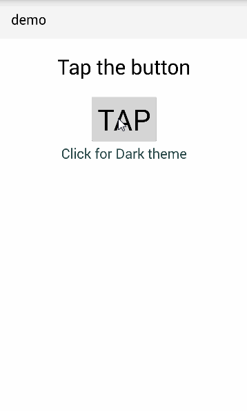

# nativescript-themes
A NativeScript plugin to deal with UI Themes

## License

This is released under the MIT License, meaning you are free to include this in any type of program -- However for entities that need a support contract, changes, enhancements and/or a commercial license please contact me (nathan@master-technology.com).

## Sample Snapshot



## Installation 

tns plugin add nativescript-themes


## Usage

To use the module you just `require()` it:

```js
var themes = require( "nativescript-themes" );
```


## You ask, how exactly does this help?
This allows you to dynamically theme an application just by calling the theme system.

red-theme.css
```css
Button {
  background-color: red;
}
```

green-theme.css
```css
Button {
  background-color: green;
}
```

## Demo
Demo shows three sample themes, and shows how to load the last chosen theme at startup.


## Why use this?
This allows you to apply a specific theme file globally so all pages get it.


### themes.applyTheme('cssFile', options);
**options.noSave** = _true_, this will cause it not to save this info for the getAppliedTheme to retrieve, this would typically used if you needed temporarily apply a theme.
```js
  var themes = require('nativescript-themes');
  themes.applyTheme('red-theme.css');
```


### theme.getAppliedTheme(<default_theme>);
This returns the last theme applied; if no theme has been applied it will use the default_theme.
```js
  var themes = require('nativescript-themes');


